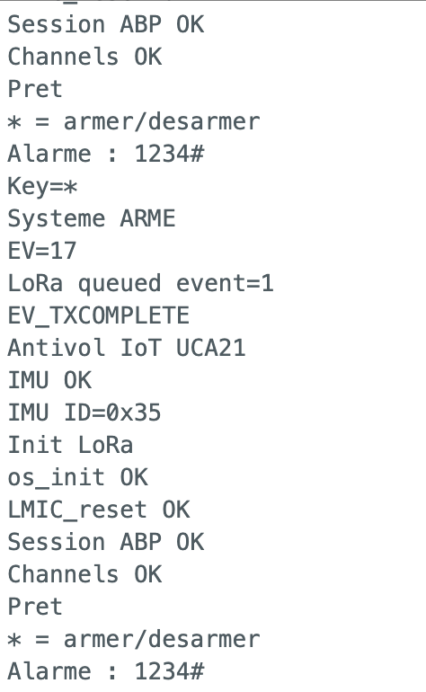
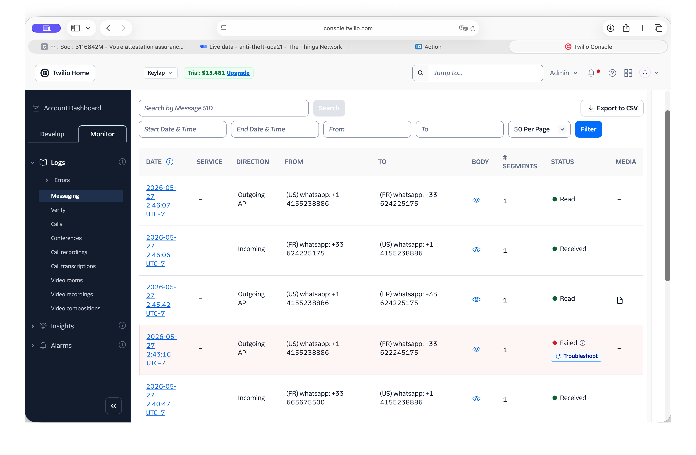

# Project : LoRa Anti-Theft System — UCA21

---

## 1. Project Goal

Build a connected anti-theft system to monitor an object (bag, suitcase, bicycle, etc.).  
The system detects abnormal movement and triggers a local alert (buzzer) as well as a remote transmission via LoRaWAN 868 MHz to The Things Network, with a WhatsApp notification via Twilio.

---

## 2. Problem Statement

How to design an autonomous system capable of:
- Detecting the displacement of an object
- Immediately alerting the user
- Reliably transmitting information remotely
- Allowing secure disarming via a secret code

---

## 3. Features

### Main Feature
- Motion detection via KXTJ3-1057 accelerometer (I2C)

### Secondary Features
- Arming via the `*` key on the numeric keypad
- Local alert via TMB12A05 active buzzer
- LoRaWAN alert transmission to TTN with 4 distinct events

### Bonus Feature
- Secure disarming via secret code on 4x4 numeric keypad
- WhatsApp notification via Twilio (TTN -> Tago.io -> Twilio)

---

## 4. How It Works

1. The user arms the system with the `*` key
2. The accelerometer monitors movement variations continuously at 6.25 Hz
3. A dynamic counter increases on movement, decreases at rest
4. If the counter exceeds the threshold (~8s of continuous movement):
   - Buzzer activated
   - LoRaWAN message sent to TTN -> Tago.io -> WhatsApp
5. The user disarms by entering the code `1234#` on the keypad

---

## 5. Hardware

| Component | Description |
|---|---|
| UCA21 board | ATmega328PB, 3.3V, 8MHz |
| KXTJ3-1057 | 3-axis accelerometer I2C (0x0E) embedded on the board|
| RFM95W | LoRa 868 MHz module embedded on the board |
| TMB12A05 | Active buzzer 3.3V on D2 |
| 4x4 keypad | Matrix keypad — arming and secret code |

---

## 6. Pin Mapping

| Pin | Role |
|---|---|
| D2 | Buzzer (OUTPUT) |
| A0, A1, A2, A3 | Keypad rows R1->R4 (OUTPUT) |
| D5, D7, D9, D3 | Keypad columns C1->C4 (INPUT_PULLUP) |
| D10 | LoRa NSS (SPI) |
| D8 | LoRa RST |
| D6 | LoRa DIO0 |
| A4 / A5 | I2C SDA / SCL (internal Wire) |

### Wiring Diagram


---

## 7. Keypad Usage

| Key | Action |
|---|---|
| `*` | Arm the system (if disarmed) |
| `*` | Clear current input (if alarm active) |
| `1234#` | Deactivate the alarm (correct code) |
| `#` | Validate the entered code |

> The default secret code is `1234`. It can be changed in the source code via `CODE_SECRET`.

---

## 8. Detection Algorithm

The system uses a dynamic counter to avoid both false positives and false negatives:

```
Movement sample  ->  counter += INCREMENT  (starts at 3)
Calm sample      ->  counter -= 1
Alarm triggered  ->  counter >= 150  (~8s of continuous movement at 6.25 Hz)
```

**Penalty system** — if movement resumes after a pause (>=1s), `INCREMENT` increases by 3 (capped at 15). This prevents bypassing the alarm with small repeated jolts.

**Calm reset** — after ~3s of sustained calm, `INCREMENT` resets to its base value.

### Key Parameters

| Parameter | Value | Description |
|---|---|---|
| `SEUIL_DIFF` | 4608 | Movement threshold (raw values, ~1.5g Manhattan) |
| `INCREMENT_BASE` | 3 | Base increment per movement sample |
| `INCREMENT_MAX` | 15 | Maximum increment (penalty cap) |
| `SEUIL_ALARME` | 150 | Trigger counter (~8s at 6.25 Hz) |
| `CALME_RESET` | 18 | Calm samples before INCREMENT reset (~3s) |

---

## 9. LoRa Events

The system sends 1 byte to TTN depending on the event:

| Value | Event |
|---|---|
| `1` | System armed |
| `2` | System disarmed |
| `3` | Alarm triggered (theft detected) |
| `4` | Wrong code entered |

### TTN Payload Formatter (JavaScript)

```javascript
function decodeUplink(input) {
  var event = input.bytes[0];
  var status = "unknown";
  if (event === 1) status = "armed";
  if (event === 2) status = "disarmed";
  if (event === 3) status = "alarm";
  if (event === 4) status = "bad_code";
  return {
    data: {
      status: status,
      event_code: event
    }
  };
}
```

---

## 10. Network Architecture

```
UCA21 (LoRa 868 MHz)
        |
  TTN Gateway (Valrose campus, Nice)
        |
  The Things Network (TTN)
        |
  Tago.io (dashboard + actions)
        |
  Twilio WhatsApp -> iPhone
```

### Serial Monitor Output



*LoRa initialization, LMIC events, arming/disarming, motion detection.*

### Twilio WhatsApp Logs



*Twilio logs confirming WhatsApp message delivery (status "Read") during tests from Valrose campus — RSSI -79 dBm, SNR 9.8.*

### Prototype


*Hardware prototype — UCA21 board with KXTJ3-1057 accelerometer, TMB12A05 buzzer and 4x4 keypad.*

---

## 11. Dependencies

### Arduino Libraries

| Library | Author |
|---|---|
| arduino-lmic | IBM / Matthijs Kooijman |
| KXTJ3-1057 | Leonardo Bispo (ldab) |
| Wire | Arduino |
| SPI | Arduino |

> Note: No external Keypad library — the keypad is handled manually to save flash memory (32KB limit on ATmega328PB).

### Board Package

- **RFTHings AVR Boards** by RFThings Vietnam
- URL: `https://rfthings.github.io/ArduinoBoardManagerJSON/package_rfthings-avr_index.json`
- Board: **UCA** -> version: **3.9 and newer : AT328PB**

### arduino-lmic configuration (`src/lmic/config.h`)

```cpp
#define CFG_eu868 1
#define CFG_sx1276_radio 1
```

---

## 12. Technical Constraints

- **Limited flash memory (32KB)**: FastLED removed, Keypad library removed, floating-point math replaced by integers (Manhattan distance)
- **EU868 duty cycle**: limited to 1% — frequent transmissions may be delayed by LMIC
- **LoRa coverage**: requires a TTN gateway in range (validated from Valrose campus, Nice)

---

## 13. Validation Criteria

- Motion detection working correctly (~8s)
- No false triggers on isolated shocks
- LoRaWAN transmission working (Valrose campus, RSSI -79 dBm)
- WhatsApp notification received via Tago.io -> Twilio
- Disarming via secret code on keypad working
- Penalty system blocking bypass attempts via small repeated movements

---

## 14. Future Improvements

- GPS geolocation module
- Deep sleep power optimization between readings
- Dedicated mobile application
- Anti-bruteforce on secret code
- 3D printed enclosure for integration in a bag

---

## File Structure

```
.
├── Anti-theft/
│   └── Anti-theft.ino
├── Picture/
│   ├── schema.html
│   ├── SerialMonitor.png
│   └── Twilio.png
|   └── prototype.png
└── README.md
```

---

*Project by Sydney Cavallin and Sasha Andrianelli — L1 Informatique, Universite Cote d'Azur
